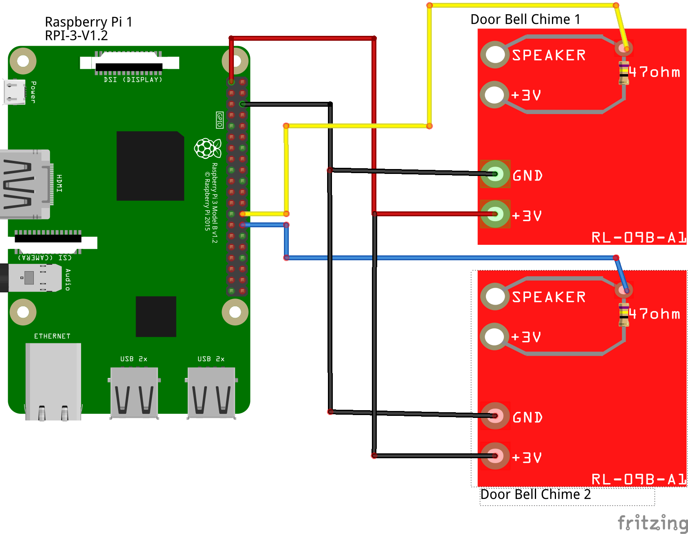
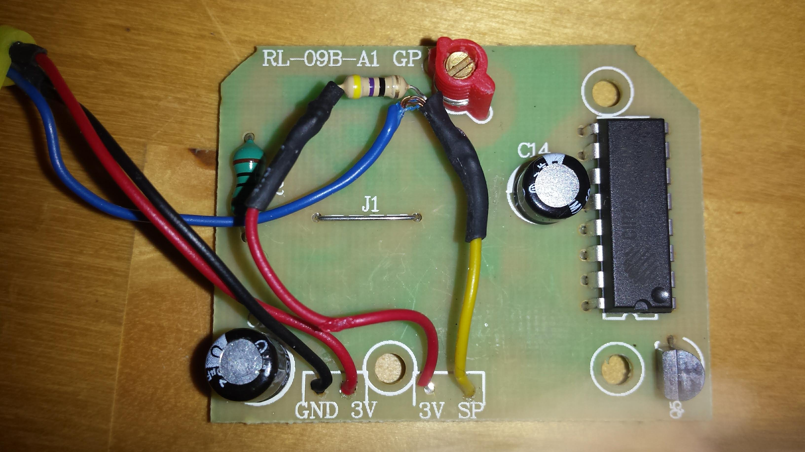

##### Raspberry Pi Doorbell Application

This application plays a sound through the Raspberry Pi 3.5mm headphone jack.
This is a **nodejs** application.

This application uses a Raspberry Pi connected to two Battery Operated Wireless Door Chimes (https://www.bunnings.com.au/hpm-battery-operated-wireless-door-chime_p4061828).
The circuitry for the chimes has been removed from the plastic housing and connected to Raspberry Pi GPIO ports.

The sound that is played is the file found in `config/sounds/default.mp3`.
This application assumes that the `mplayer` application is installed on the Raspberry Pi.

This application allows you to set up notifications to be sent via services to alert you of a doorbell press.
The services that are currently set up to receive a trigger are: 

- Facebook Messages (https://developers.facebook.com/docs/messenger-platform/send-messages/)
- Pushbullet (https://docs.pushbullet.com/)
- SMS Gateway Me (https://smsgateway.me/sms-api-documentation/getting-started)

The parameters for these services are configured in `config/default.json` and `bin/start_door_bell.sh` files.

###### Prerequisites
- Hardware
  
  - This uses modified HPM doorbell chimes and buttons connected to Raspberry Pi GPIO ports.
  Specifically the [HPM D642/05](https://hpm.com.au/product/white-square-50m/) model has been used but you can use a similar one. (See also the [Instruction Manual](https://hpm.com.au/app/uploads/2018/05/d642-05-hpm-wireless-door-chime-instruction-sheet-593658e3da810.pdf)).
  Each doorbell was modified by replacing the speaker with a 47 ohm resistor. The GPIO was then connected to one side of this resistor to await a trigger of the doorbell button being pressed.

  See the attached circuit diagram:
  

  For doorbell modifications, see 
  

  For Raspberry Pi connections see
  


- Software Dependencies
    
    - This is a **nodejs** application. In order to install this application you need to install `npm`.
        - See https://docs.npmjs.com/downloading-and-installing-node-js-and-npm for more details.
    - `mplayer` application
        - See below instructions under _Getting Started_ for installing `mplayer`.
    

###### Getting Started
1. Connect the Raspberry Pi GPIO port one or two Doorbell chimes.
   Update the `config/default.json` parameters (`doorbell_pin_1` and `doorbell_pin_2`) with the appropriate port numbers.
   Note that these will be the **GPIO** port numbers and _not_ the physical pins from the head.
   See https://pinout.xyz/pinout/wiringpi#.
   
2. Install `mplayer` application.
   Ensure that the `mplayer` application is installed.
   If it is not then use the following commands to install:
   
   ```
   sudo update
   sudo apt-get install mplayer
   ```
   
   To test, ensure you have connected a speaker to the headphone jack and run the following commands: 
   
   ```
   cd <directory_where_application_is_cloned>/config/sounds
   mplayer default.mp3 
   ```

3. Install the node modules.
   Use the following commands to download and install the modules:
   
   ```
   cd <directory_where_application_is_cloned>
   npm install
   ```
   
4. Create a symlink from `/home/pi/bin/start_door_bell.sh` to `<directory_where_application_is_cloned>/bin/start_door_bell.sh`:

    - for example if you have cloned the application into the directory, `/home/pi/my_pi_doorbell`, then use the following command to create a symlink:
        
        ```
        ln -s /home/pi/my_pi_doorbell/bin/start_door_bell.sh /home/pi/bin/start_door_bell.sh
        ```
                
   Test that the startup script is working by running the following command:
   
   ```
   /home/pi/bin/start_door_bell.sh
   ```
   
   Try each of the doorbell buttons to confirm that you hear a sound.
   
Congratulations! You have installed the application successfully! 
To have the application start automatically when you start the Raspberry Pi, follow the instructions for  `doorbell.service` under the [Pi Doorbell bin directory](#pi-doorbell-bin-directory) heading below. 
   

###### Application and Service Configuration

The `config/default.json` file is used to configure parameters for both the doorbell set up connected to the Raspberry Pi and the services that you wish to use when a doorbell press is performed.

- Doorbell parameters:
    - `doorbell_pin_1` : sets the GPIO pin of the _first_ doorbell
    - `doorbell_pin_2` : sets the GPIO pin of the _second_ doorbell
- Service parameters:
    - Parameters for the services that you wish to use are defined under the `services` parameter in the `config/default.json` file.
    - `enabled` : Each service can be enabled using this parameter by setting it as `true` or `false`.
    - `params` : This is service specific parameters. These are detailed in comments for each Service in the `config/default.json` file.

###### Pi Doorbell bin directory

This directory contains the following files:

- `start_door_bell.sh`
    - This file is a bash script to start the application.
    - This holds the API Key information, as environment variables, for the services:
        - Facebook Messages (https://developers.facebook.com/docs/messenger-platform/send-messages/)
        - Pushbullet (https://docs.pushbullet.com/)
            - Currently _only_ Notes are sent using Pushbullet.
        - SMS Gateway Me (https://smsgateway.me/sms-api-documentation/getting-started)
    - The following environment variables are used:
        - Facebook Messages
            - FB_PAGE_ACCESS_TOKEN : Access Token for Facebook Messages API
            - FB_RECEIVER_ID : Receiver ID for Facebook Messages API
        - Pushbullet (https://docs.pushbullet.com/)
            - PB_API_KEY : Pushbullet API Access Token (https://docs.pushbullet.com/#api-quick-start)
        - SMS Gateway Me (https://smsgateway.me/sms-api-documentation/getting-started)
            - SMSG_PASS : Smsgateway password for your account
            - **NOTE** that at the time of writing this Android app was removed from Google Play
    - If you do not wish to use these services then you can leave these environment variables commented out.

- `doorbell.service`
    - This file is used as a Raspberry Pi systemd service to start the application at boot time
    - This file assumes that the startup file (`start_door_bell.sh`) is in the directory `/home/pi/bin/start_door_bell.sh`
       
    - In order for this to take place you need to copy this file to `/etc/systemd/system` as `root` user.
    - Ensure that the access permissions are set to `-rw-r--r--`
        - You can use the command `sudo chmod 644 /etc/systemd/system/doorbell.service`. 
    - You can also run the commands to stop, start and review the status of the application:
        - Stop the service:
            - sudo systemctl stop doorbell
        - Start the service:
            - sudo systemctl start doorbell
        - Show Status of the service:
            - sudo systemctl status -l doorbell
            
- `www`
    - This starts the application http server.
    - This is currently only as a default [Express server](https://www.npmjs.com/package/express).
